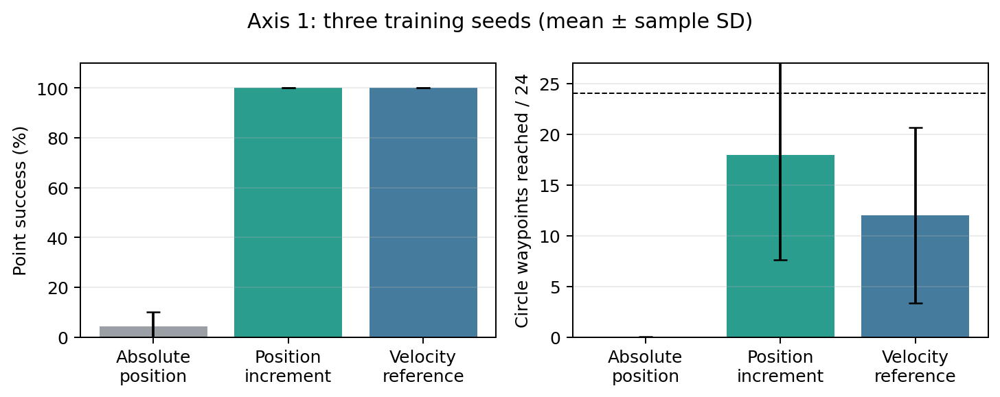
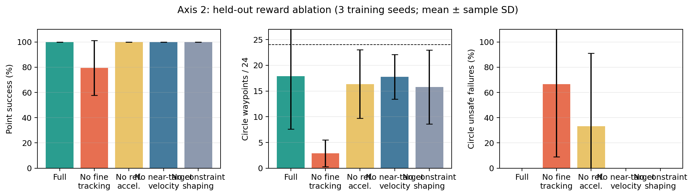
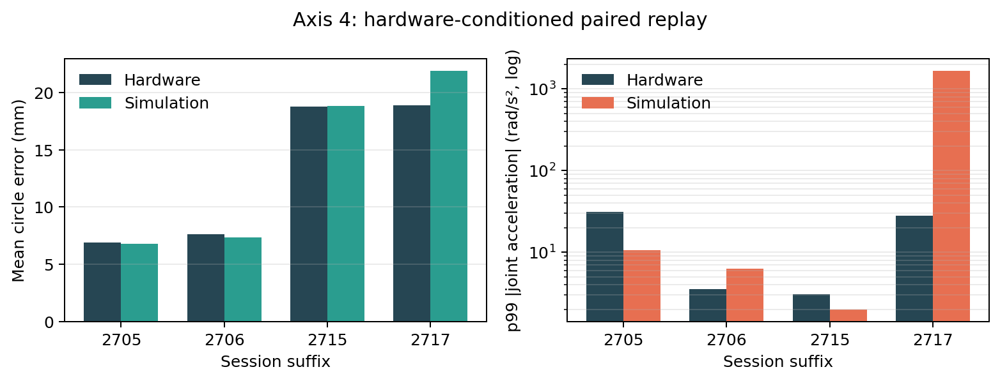

# Sim-to-Real Reinforcement Learning for FR3 Reaching and Circle Tracking

## Executive summary

This project built a manager-based Isaac Lab task, trained PPO policies for a Franka Research 3 (FR3), exported them to ONNX, and deployed two learned control contracts on the real robot. The stack runs at 50 Hz above a 1 kHz Franky/libfranka impedance loop with measured-state feedback, gravity/Coriolis compensation, YAML-defined waypoint suites, and runtime safety checks.

The strongest representation was **joint-position increment**. Across three training seeds it achieved 100% success on 1,536 held-out point-reaching episodes and the best circle result (17.9/24 waypoints on average). Absolute joint-position output failed under the shared deployment delay and demanded roughly 9.5 times the configured velocity envelope. Joint-velocity reference also reached random points, but was less accurate, less seed-stable on the circle, and exposed unstable high-gain regions in simulation.

Four hardware sessions completed safely with no dropped 1 kHz samples. Paired hardware-conditioned replay reproduced circle geometry within 0.26 mm for both position-reference sessions and within 0.05 mm for the low-gain velocity session. It did **not** reproduce high-gain velocity dynamics: simulation reached 1,679 rad/s² p99 joint acceleration versus 27.8 rad/s² on hardware. The simulator is useful for policy and geometric studies, but the present high-gain velocity plant/controller model is not a validated hardware safety surrogate.

### Completion audit

Three axes now have compiled evaluation results. Axis 1 compares policy outputs, Axis 2 evaluates reward ablations, and Axis 4 pairs simulation with four hardware sessions. Axis 3 remains incomplete: its first DR seed stopped because PPO's learned `log_std` became non-finite, so no three-seed DR comparison exists. That failure is reported explicitly rather than converted into an unsupported robustness claim.

| Axis | Artifact status | Defensible conclusion |
|---|---|---|
| 1. Policy output | **Complete:** 3 outputs × 3 seeds, paired point and circle evaluation | Position increment is the preferred contract |
| 2. Reward tuning | **Complete:** 5 variants × 3 seeds, paired point and circle evaluation | Fine tracking and near-target braking are important; constraint shaping showed no benefit |
| 3. Domain randomization | **Incomplete:** DR seed 42 diverged; seeds 123/456 were not launched | No final incremental-policy DR claim |
| 4. Sim versus real | **Complete:** 4 hardware-conditioned replay jobs | Strong geometric parity in 3 cells; high-gain velocity dynamics mismatch |

## System and policy contract

| Layer | Implementation |
|---|---|
| Training | Isaac Sim/PhysX, Isaac Lab manager-based environment, RSL-RL PPO |
| Robot | FR3v2 bare flange; payload retained as a randomizable parameter |
| Training task | Reactive move-and-settle Cartesian reaching |
| Evaluation task | Random targets and a 24-waypoint, 0.15 m YZ circle |
| Policy rate | 50 Hz with one 20 ms effective command delay in evaluation/deployment |
| Preferred observation | 29 values: `q-q_default` (7), measured `dq` (7), target-minus-flange position (3), normalized reference (6), previous action (6) |
| Preferred action | Six bounded joint-position increments; joint 7 held at home |
| Hardware controller | 1 kHz impedance loop, `tau = K(q_ref-q) + D(dq_ref-dq) + coriolis` |
| Path scheduler | Advance on tolerance or per-waypoint timeout; future waypoints are hidden |

The circle is a sequence of unseen move-and-settle targets, not a trajectory-preview tracking problem.

## Axis 1 — Policy output and controller choice

All representations used seeds 42, 123, and 456 and a matched 150-iteration/1,024-environment budget. Evaluation imposed the same one-step delay, replayed random targets and initial states, and the same `circle_yz` path. This compares complete output/controller contracts; it does not isolate encoding while holding every reward semantic constant.

| Output contract | Point success | Final point error | Point time-to-success | Circle completion | Mean circle waypoints | Mean circle error | Peak velocity / envelope |
|---|---:|---:|---:|---:|---:|---:|---:|
| Absolute position | 4.4 ± 5.6% | 182.3 ± 121.6 mm | 1.29 ± 0.08 s* | 0.0 ± 0.0% | 0.02 ± 0.04 | 185.6 ± 115.1 mm | 9.53 ± 0.94× |
| **Position increment** | **100.0 ± 0.0%** | **20.1 ± 0.5 mm** | **1.87 ± 0.00 s** | **58.3 ± 52.0%** | **17.92 ± 10.32** | **32.5 ± 2.0 mm** | **1.016 ± 0.002×** |
| Velocity reference | 100.0 ± 0.0% | 23.5 ± 1.2 mm | 2.15 ± 0.07 s | 6.3 ± 10.8% | 12.00 ± 8.63 | 34.1 ± 3.1 mm | 1.95 ± 0.58× |

Values are mean ± sample standard deviation across training seeds. Point totals are 1,536 episodes per output; circle totals are 48 attempts per output. *Absolute-position time-to-success is conditional on its small successful subset and must not be read as superior speed.

The experiment resolves the original range/smoothness conflation. Absolute position maps a bounded action directly into a bounded range, so its scale changes both reach and command step. Position increment instead projects `q_ref[t] + dq_max dt action` into the full soft joint range: the action limits only the next 20 ms change, while repeated actions can traverse the workspace. Circle generalization was still seed-sensitive—individual incremental seeds completed 100%, 75%, and 0% of circle attempts—so the mean must not hide training variance.

The velocity policy had lower reference-tracking error but not better Cartesian performance. One circle seed had a 100% unsafe-failure rate and another produced an 8.10× peak velocity ratio. Velocity reference is not automatically smoother or safer merely because its command has physical units.

## Axis 2 — Reward tuning on position increments

The reward matrix keeps the task-defining coarse Cartesian reward and self-collision guard fixed and removes only interpretable terms/groups.

| Term | Weight | Purpose |
|---|---:|---|
| Coarse position tracking | +1.0 | Exponential approach signal (`sigma=0.05`) |
| Fine position tracking | +1.0 | Terminal precision (`sigma=0.0025`) |
| Reference acceleration | -0.001 | Penalize changes in physical reference velocity |
| Near-target reference velocity | -0.002 | Encourage braking inside 5 cm |
| Measured velocity envelope | -0.002 | Penalize measured speed above the configured envelope |
| Action-clipping overshoot | -0.1 | Penalize raw actor output beyond `[-1,1]` |
| Reference projection | -0.1 | Penalize requests removed by soft joint-limit projection |
| Self-collision/contact | -1.0 | Safety guard, held fixed |

All 15 checkpoints were evaluated with the same one-step delay, replayed point targets/initial states, and `circle_yz` path. Point totals are 1,536 episodes per variant; circle totals are 48 attempts per variant. Values are mean ± sample standard deviation across seeds.

| Reward variant | Point success | Final point error | Circle completion | Mean circle waypoints | Mean circle error | Circle unsafe failures |
|---|---:|---:|---:|---:|---:|---:|
| **Full reward** | **100.0 ± 0.0%** | **20.1 ± 0.5 mm** | **58.3 ± 52.0%** | **17.92 ± 10.32** | 32.5 ± 2.0 mm | **0.0 ± 0.0%** |
| No fine tracking | 79.5 ± 21.7% | 35.1 ± 16.2 mm | 0.0 ± 0.0% | 2.90 ± 2.59 | 55.8 ± 17.9 mm | **66.7 ± 57.7%** |
| No reference acceleration | 100.0 ± 0.0% | 21.3 ± 1.3 mm | 33.3 ± 57.7% | 16.35 ± 6.66 | 33.3 ± 1.5 mm | **33.3 ± 57.7%** |
| No near-target velocity | 100.0 ± 0.0% | 19.8 ± 0.3 mm | **2.1 ± 3.6%** | 17.77 ± 4.35 | 31.5 ± 1.8 mm | 0.0 ± 0.0% |
| No constraint shaping | 100.0 ± 0.0% | 21.0 ± 1.6 mm | 33.3 ± 57.7% | 15.79 ± 7.18 | 31.4 ± 2.5 mm | 0.0 ± 0.0% |

**Fine tracking is essential.** Its removal was the only change that damaged random-point success, and it failed every complete-circle attempt. Two of its three circle seeds terminated unsafely; one reached an 8.46× peak velocity ratio and introduced reference projection. The narrow terminal reward is therefore not merely cosmetic—it prevents the policy from settling for coarse proximity and improves closed-loop reliability.

**Near-target velocity primarily affects completion, not approach.** Removing it preserved 100% random-point success and almost the same mean circle progress (17.77 versus 17.92 waypoints), yet complete-circle success fell from 58.3% to 2.1%. This is exactly the intended distinction: the policy can approach successive targets but is less able to brake and satisfy every timeout/tolerance transition.

**Reference acceleration is a cautious retention rather than a clean causal win.** Its removal kept point success at 100% and did not increase aggregate reference-acceleration ratios; nevertheless, one seed failed unsafely during circle evaluation and projected its reference. With only three seeds, the data support retaining the term for reliability but do not show that its current weight directly lowers the reported acceleration metric.

**Constraint shaping was non-binding in training and showed no evaluation benefit.** Removing the velocity-envelope/clipping/projection group preserved point success and caused no unsafe failures. In the full policy, clipping and projection were zero; evaluation frequently detected tiny envelope exceedances, but the mean peak ratio was only 1.014× and was not improved by retaining the group. These terms can remain as low-cost guards, but they are not responsible for nominal performance and should not be presented as the main smoothness mechanism.

## Axis 3 — Focused deployment domain randomization

The focused incremental-policy DR task was designed around variables that can change on the robot:

- gain scale `alpha ~ LogUniform[0.5,2.0]`, with `K=100 alpha` and coupled damping;
- policy delay sampled from `{0,1}` 20 ms steps;
- flange payload mass in `[0,1]` kg; and
- payload COM x/y in `[-0.03,0.03]` m and z in `[0,0.05]` m.

It excludes friction, armature, observation noise, link-inertia scales, and extra reset spread so the comparison answers a narrow deployment question. Nominal controls for seeds 42/123/456 were imported from Axis 1. The DR run for seed 42 stopped roughly halfway through the 150-iteration budget when learned `log_std` became non-finite. Its last snapshot had 25.8 mm training error and 100% batch success, but an incomplete pre-divergence snapshot is not a comparable final policy. Seeds 123 and 456 were not launched by the fail-fast sequence.

Earlier Panda absolute-position and broad-DR pilots remain hypothesis-generating only. They cannot establish that DR helps the preferred incremental controller. Recovery requires stabilizing PPO variance/learning rate, training three complete DR seeds, then running paired cells for low/high PD, one-step delay, payload mass, payload+COM, and a combined in-distribution condition.

## Axis 4 — Paired simulation versus hardware

Each replay verifies an immutable hardware session, resolves the deployed checkpoint, initializes simulation from the first measured `q,dq`, installs recorded waypoints/timeouts, and applies the recorded route, K/D gains, limits, delay, and reference contract.

| Session | Route and gains | HW / sim waypoints | HW / sim mean circle error | HW / sim p99 acceleration | HW / sim peak speed | Fault mismatch |
|---|---|---:|---:|---:|---:|---|
| 2026092705 | Position, K200/D28.3 | 24 / 24 | 6.87 / 6.76 mm | 31.0 / 10.6 rad/s² | 1.07 / 0.53 rad/s | No |
| 2026092706 | Position, K100/D20 | 24 / 24 | 7.60 / 7.34 mm | 3.52 / 6.35 rad/s² | 0.50 / 0.50 rad/s | No |
| 2026092715 | Velocity, K100/D20 | 7 / 6 | 18.76 / 18.81 mm | 3.05 / 2.00 rad/s² | 0.42 / 0.44 rad/s | **Yes: sim fault** |
| 2026092717 | Velocity, K200/D40 | 6 / 10 | 18.91 / 21.88 mm | 27.8 / **1,679.3** rad/s² | 1.17 / **5.26** rad/s | No |

Low-gain position and velocity cells match geometry and peak speed closely. Position K200 retains geometric accuracy but simulation under-predicts the hardware transient, torque, and peak speed. Velocity K100 matches mean circle error to 0.05 mm but ends in a simulation-only fault. Velocity K200 becomes dynamically extreme in simulation while hardware remains bounded. Matching path geometry is not equivalent to matching closed-loop dynamics.

All hardware sessions stopped normally, reported no robot/last-motion errors, and dropped no 1 kHz samples. Position K100/D20 reached all 24 waypoints with much lower acceleration than K200. Velocity K100/D20 is preferable to K200/D40, but reached only 7/24 strict 10 mm waypoints. This demonstrates a safe learned waypoint stack, not millimeter-accurate continuous path tracking.

## Main conclusions

1. **Use position increments for this task.** They separate total range from per-step smoothness and dominate the other contracts in the controlled comparison.
2. **Keep fine tracking and near-target braking.** Fine tracking is required for precision and safety; near-target velocity is required for reliable waypoint completion. Reference acceleration remains a conservative reliability guard, while constraint shaping is mostly dormant.
3. **Do not claim focused DR success yet.** The intended experiment is sound, but the recorded DR training diverged.
4. **Treat simulator dynamics as controller-region dependent.** Geometry was reproduced well at low gains, while high-gain velocity dynamics were not.
5. **The deployment is complete and reproducible.** The project carries a learned policy from batched simulation to deterministic ONNX inference, YAML path scheduling, a 1 kHz real-time controller, and auditable hardware logs.

## Reproducibility and artifacts

- Axis 1 compiled results: `${FRANKA_RL_DATA_ROOT}/evaluation_suites/axis1_policy_output_three_seed/`
- Axis 2 compiled results: `${FRANKA_RL_DATA_ROOT}/evaluation_suites/2026-09-28_11-38-52_axis2_reward_ablation_three_seed/`
- Axis 3 failed manifest/log: `${FRANKA_RL_DATA_ROOT}/training_matrices/2026-09-28_10-20-32_axis3_incremental_nominal_vs_deployment_dr_three_seed/`
- Axis 4 compiled replay: `${FRANKA_RL_DATA_ROOT}/evaluation_suites/2026-09-28_10-39-01_axis4_hardware_paired_replay/`
- Complete hardware package: `${FRANKA_RL_DATA_ROOT}/hardware_tracking_2026-09-27_complete/`
- Experiment runners: [`scripts/experiments`](scripts/experiments/)
- Deployment contract and audit: [`deployment/HANDOFF_AGENT.md`](deployment/HANDOFF_AGENT.md) and [`deployment/HANDOFF_README.md`](deployment/HANDOFF_README.md)
- Path definitions: [`paths.yaml`](source/franka_rl/franka_rl/config/paths.yaml)

Large logs and checkpoints remain on the data volume; the repository contains only source, lightweight derived figures, configuration, and this report.
