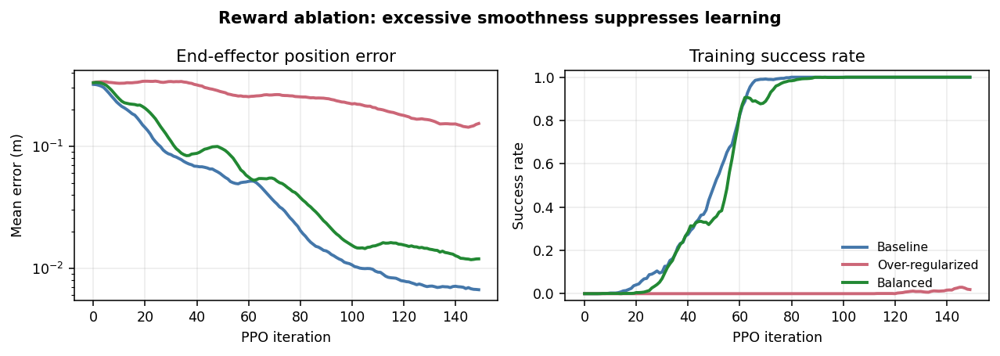
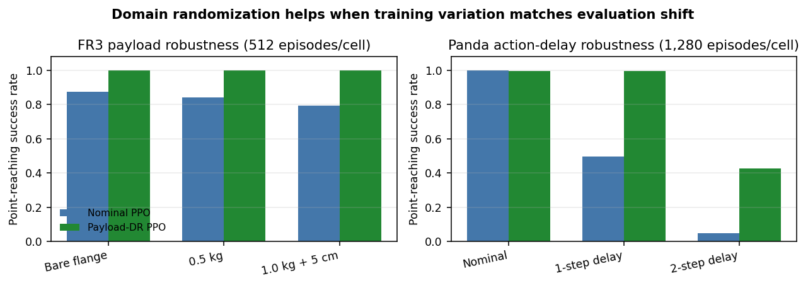
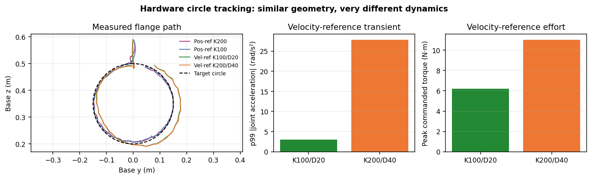

# Sim-to-Real Reinforcement Learning for FR3 Reaching and Circle Tracking

## Executive summary

This project developed a manager-based Isaac Lab environment, trained PPO policies for a Franka Research 3 (FR3), and deployed two learned control routes on real hardware. Both policies observe joint state and Cartesian target error and run at 50 Hz. The more accurate route emits six bounded position increments into a persistent joint reference. The later route emits six joint-velocity references to provide a nonzero velocity feedforward term. Joint 7 is held at its home value because it did not materially improve the position-only task. A 1 kHz Franky/libfranka impedance loop tracks either reference contract with gravity/Coriolis compensation and safety supervision.

The central engineering result is not simply that a learned policy moved the robot. It is that the policy contracts were carried from batched GPU simulation to a deterministic ONNX hardware runtime with measured-state feedback, reproducible YAML path definitions, zero dropped samples, and safe completion of four circle-tracking sessions. The experiments also exposed two important limitations: pilot domain-randomization results were mixed and depended on the action/controller contract, and completing a scheduled path is weaker than satisfying every waypoint tolerance.

## System and policy contract

| Layer | Implementation |
|---|---|
| Training | Isaac Sim/PhysX + Isaac Lab manager-based task + RSL-RL PPO |
| Robot model | FR3v2, bare flange; payload retained as a randomizable parameter |
| Task | Move-and-settle Cartesian reaching; circle tracking is an unseen-target evaluation sequence |
| Policy rate | 50 Hz |
| Observation | 29 values: `q-q_default` (7), measured joint velocity (7), target-minus-flange position (3), normalized joint reference (6), and previous normalized action (6) |
| Action | Six normalized position increments or joint-velocity references; joint 7 is held fixed |
| Delay model | One policy-step command delay |
| Hardware loop | 1 kHz joint impedance controller, `tau = K(q_ref-q) + D(dq_ref-dq) + coriolis`, plus Franka safety limits |
| Path contract | YAML-defined waypoints; advance when error is below threshold or when that waypoint times out |

The policy is reactive: it sees only the current target, not future circle waypoints. Circle following therefore tests repeated move-and-settle behavior rather than a trajectory-preview controller.


## Comparison framework and evidence status

The report is organized around four distinct experimental axes. They should not be mixed in one comparison because changing the action representation also changes the controller interface and the reward quantities that are physically meaningful.

| Axis | Controlled baseline | Current evidence | Missing deliverable |
|---|---|---|---|
| Policy output | Same FR3 task, targets, PPO budget, and K=100/D=20 controller | Absolute position, position increment, and velocity policies were all exercised; the two latter routes reached hardware | Training and comparison workflow implemented; execute remaining seeds and populate results |
| Reward tuning | Six-axis position-increment policy | Individual tuning iterations exist, but no complete term-by-term ablation | Multi-seed leave-one-term/group-out ablation |
| Domain randomization | Same position-increment reward and PPO configuration | Legacy Panda absolute-position and earlier FR3 results are informative pilots only | New position-increment nominal-versus-DR experiment with one-factor evaluation cells |
| Simulation versus real | Exact deployed checkpoint and controller contract | Four complete hardware sessions and non-paired simulation evaluations | Hardware-log-conditioned paired replay in Isaac Lab |

## Axis 1 — Policy output and controller choice

| Policy output | Reference update | Main benefit | Observed limitation | Evidence status |
|---|---|---|---|---|
| Absolute position | `q_ref = center + scale * action` | Simple and learns reaching | The chosen scale and `[-1,1]` action bound jointly constrained reachable range and command change; aggressive policies were not smooth | Historical simulation only |
| Position increment | `q_ref[t+1] = project(q_ref[t] + dq_max * dt * action)` | Separates total joint range from per-step smoothness; most stable and accurate route | The Franky position-reference route supplies zero desired velocity between updates; high stiffness reacted strongly to held 50 Hz references and produced startup jitter | Simulation plus two hardware sessions |
| Velocity | Integrate `dq_ref` at 1 kHz and apply `D(dq_ref-dq)` | Supplies velocity feedforward and removed the position-route startup behavior | Lower terminal accuracy; the velocity-reference loop was sensitive to gains and had unstable regions in simulation | Simulation plus two hardware sessions |

The position-increment representation is therefore the reference task for reward and DR studies. It directly addresses the original range/smoothness conflation: the integrator may traverse the complete soft joint range over time, while the action bound limits only the next 20 ms increment. Smoothness remains a learned objective rather than a second motion planner.

Because the study reuses the existing checkpoints, it compares the complete output/controller contracts rather than isolating action encoding alone: the original absolute and incremental policies were trained without an imposed delay, while the velocity task included its required one-step delay. All comparison evaluations impose the same deployment-relevant one-step delay. A strictly causal encoding-only comparison would require retraining all three representations with identical delay and reward semantics.

### Implemented workflow and remaining execution

- [`axis1_policy_output_training.yaml`](source/franka_rl/franka_rl/config/experiments/axis1_policy_output_training.yaml) defines the matched training seeds `{42,123,456}`, existing checkpoints, task IDs, and the common 150-iteration/1,024-environment budget.
- [`run_axis1_seed_training.py`](scripts/experiments/run_axis1_seed_training.py) detects the existing seed per representation and trains only the two missing seeds. It is resumable, sequential by default, and writes a checkpoint manifest consumed by evaluation.
- [`run_axis1_comparison.py`](scripts/experiments/run_axis1_comparison.py) creates point and `circle_yz` suites for all nine checkpoints. Point evaluation shares exact replayed targets and initial states; circle evaluation shares the path and evaluation seed. Both suites impose one policy-step delay on every representation.
- Evaluation suites now support a task override per checkpoint, and an absolute-position circle task was added so policies with different observation/action contracts can coexist in one suite.
- The comparison compiler exports per-checkpoint results plus mean and standard deviation across the three training seeds for each output representation.

The remaining work is experimental execution. Representation-independent metrics are sustained reach success, terminal error, time to success, circle waypoint success, geometric path error, measured joint speed/acceleration, torque, contact/fault counts, and command projection. Representation-specific diagnostics—absolute command step, incremental `q_ref` step, or velocity-reference step—must remain separate; raw normalized action magnitude is not comparable across representations.

**Placeholder — controlled policy-output comparison**

| Output | Point success | Circle waypoints | Circle error | p99 acceleration | Fault rate |
|---|---:|---:|---:|---:|---:|
| Absolute position | TBD | TBD | TBD | TBD | TBD |
| Position increment | TBD | TBD | TBD | TBD | TBD |
| Velocity reference | TBD | TBD | TBD | TBD | TBD |

## Axis 2 — Reward tuning on the position-increment policy

The formal reward study uses the six-axis position-increment task, not the absolute-position or velocity tasks. The inventory below distinguishes terms that define the task, behavioral shaping terms worth ablating, and sparse constraint terms that should be tested as one group.

| Term | Weight | Definition and study role |
|---|---:|---|
| Coarse position tracking | +1.0 | Exponential Cartesian reward, `sigma=0.05`; essential approach signal, held fixed |
| Fine position tracking | +1.0 | Narrow exponential reward, `sigma=0.0025`; terminal-precision ablation |
| Reference acceleration | -0.001 | Normalized squared change in physical reference velocity; smoothness ablation |
| Near-target reference velocity | -0.002 | Normalized reference-speed penalty active only inside 5 cm; settling ablation |
| Measured velocity envelope | -0.002 | Hinge penalty on measured speed above the 20% dynamics envelope; grouped constraint shaping |
| Action-clipping overshoot | -0.1 | Squared raw-action excess outside `[-1,1]`; grouped constraint shaping |
| Reference projection | -0.1 | Squared increment removed by soft joint-limit projection; grouped constraint shaping |
| Self-collision/contact | -1.0 | Moving-link contact penalty; safety guard held fixed |

Let `v_ref,t` be the joint-reference velocity implied by the current position increment and `dt=0.02 s`. Reference acceleration is `(v_ref,t-v_ref,t-1)/dt`, normalized joint-wise by the configured acceleration envelope before squaring. Near-target reference velocity applies the normalized `v_ref,t` cost only when Cartesian error is below 5 cm, encouraging the policy to brake and settle without discouraging fast approach motion. Measured velocity envelope instead reads the peak physical joint speed over the 1 kHz physics ticks in each policy interval and penalizes only the excess above the envelope; it does not clamp physical speed. Action-clipping overshoot compares the raw actor output with its processed `[-1,1]` value. Reference projection compares the requested integrated joint reference with the reference after soft joint-limit projection. The latter two are normally zero and primarily reveal invalid requests.

Raw action magnitude, generic action-rate, generic joint-velocity, absolute position-command difference, and joint-7 posture penalties are disabled. This is intentional: the learned quantity should be physical reference smoothness, not small normalized actions, and joint 7 is held rather than controlled.

The existing reward figure is a **velocity-policy tuning pilot**, not the formal ablation. It demonstrated a general failure mode—an excessive acceleration penalty suppressed exploration—but it does not isolate the reward terms of the preferred position-increment policy.

| Velocity-policy pilot | Reference-acceleration weight | Excess-acceleration weight | Final training error | Final training success |
|---|---:|---:|---:|---:|
| Baseline | -0.001 | 0 | 6.6 mm | 100% |
| Over-regularized | -0.01 | -0.05 | 164 mm | 0.6% |
| Balanced | -0.01 | -0.0005 | 11.8 mm | 100% |



### Implemented reduced ablation

The executable matrix is in `axis2_reward_ablation_training.yaml`. Four registered task variants remove one behavioral term or the complete constraint-shaping group. Coarse tracking and self-collision remain fixed because removing the primary task signal is not informative and disabling a rarely activated collision guard creates avoidable unsafe exploration. The seed coordinator can import the three position-increment checkpoints from the Axis-1 manifest as its full-reward control, avoiding duplicate training, and trains each ablation at seeds 42, 123, and 456. Without that manifest it still reuses the established seed-42 checkpoint. The comparison coordinator evaluates paired random targets and `circle_yz` under the common one-step-delay protocol, then exports per-checkpoint values and mean ± standard deviation across training seeds.

**Placeholder — reduced position-increment reward ablation**

| Removed term/group | Point success | Terminal error | Time to success | Circle waypoints | Peak acceleration ratio | Associated violation |
|---|---:|---:|---:|---:|---:|---:|
| None (full reward) | TBD | TBD | TBD | TBD | TBD | TBD |
| Fine position tracking | TBD | TBD | TBD | TBD | TBD | TBD |
| Reference acceleration | TBD | TBD | TBD | TBD | TBD | TBD |
| Near-target reference velocity | TBD | TBD | TBD | TBD | TBD | TBD |
| Constraint shaping: velocity envelope + clipping + projection | TBD | TBD | TBD | TBD | TBD | TBD |

Selection is based on task performance and the diagnostic associated with each removal—not training return alone. Any apparent gain accompanied by materially higher measured-speed exceedance, clipping, projection, contact, or fault rates is rejected for deployment.

## Axis 3 — Domain randomization on the position-increment policy

Earlier results are useful pilot evidence, but they are not the final DR comparison. The Panda study used the absolute-position action representation and produced aggressive motion; this can make the nominal policy appear artificially fragile. The earlier FR3 payload experiment also predates the final position-increment reward/controller contract. These results therefore motivate hypotheses but should not be used as the headline robustness claim.

| Legacy pilot | Scenario | Nominal PPO | DR PPO | Interpretation |
|---|---|---:|---:|---|
| FR3 point reaching | Bare flange | 87.7% | 100.0% | Promising, but task contract predates the final incremental baseline |
| FR3 point reaching | 0.5 kg payload | 84.4% | 100.0% | Payload variation appears useful |
| FR3 point reaching | 1.0 kg payload, 5 cm COM offset | 79.3% | 100.0% | Payload/COM shift produced the largest pilot benefit |
| Panda absolute-position reaching | One-step command delay | 49.5% | 99.8% | Confounded by aggressive absolute-position policy behavior |
| Panda absolute-position reaching | Two-step command delay | 4.8% | 42.5% | DR helped but did not solve the out-of-distribution delay |



A later broad-DR position policy failed all 16 circle trials in each of six calibration cells, while the nominal policy passed 16/16 in five cells and 11/16 in the hardest low-gain randomized cell. This is further evidence that DR is not a generic robustness switch: an overly broad distribution can consume policy capacity or optimize a task different from deployment.

### Implemented DR task and planned comparison

The registered task `Franka-FR3v2-FrankyImpedance-Incremental6DReach-DR-v0` preserves the nominal six-action/29-observation contract, rewards, 1 kHz controller, 50 Hz policy rate, reset distribution, and terminations. Training is guarded so this task must use `fr3_incremental_deployment_dr_v1`; it cannot silently run nominally. The focused scenario samples independently on every environment reset:

- impedance gain scale `alpha` log-uniformly in `[0.5, 2.0]`, giving `K=100*alpha` and `D=2*sqrt(K)`;
- policy delay uniformly from `{0,1}` 20 ms steps, with reset history filled by the current held-reference command;
- flange payload mass uniformly in `[0,1]` kg; and
- payload COM with x/y in `[-0.03,0.03]` m and z in `[0,0.05]` m relative to the flange origin.

Friction, armature, link inertia, observation noise, and additional reset spread are deliberately excluded. They cannot obscure whether the deployment-adjustable factors themselves help. The paired training matrix uses the same 150-iteration budget and seeds 42, 123, and 456 for nominal and DR policies; completed Axis-1 position-increment checkpoints can be imported as the nominal controls, while every DR policy starts from scratch.

Remaining experimental work:

1. Evaluate one factor or physically coupled group at a time while all others remain nominal: PD gain, delay, payload mass, and payload+COM. Include one combined in-distribution cell and clearly separated extrapolation cells.
2. Use exact paired initial states and target sequences for nominal and DR policies. Report success, terminal/path error, time, velocity/acceleration, torque, clipping/projection, self-contact, and unsafe termination rates.
3. Only after the focused comparison is understood should secondary randomizers—joint friction, armature, link inertia, observation noise, or wider reset poses—be considered.

**Placeholder — position-increment nominal versus DR**

| Evaluation cell | Fixed variation | Nominal success | DR success | Nominal error | DR error | Dynamics/safety delta |
|---|---|---:|---:|---:|---:|---:|
| Nominal | None | TBD | TBD | TBD | TBD | TBD |
| PD low | K=50 with coupled damping | TBD | TBD | TBD | TBD | TBD |
| PD high | K=200 with coupled damping | TBD | TBD | TBD | TBD | TBD |
| Delay 1 | One 20 ms policy step | TBD | TBD | TBD | TBD | TBD |
| Delay 2, extrapolation | Two policy steps | TBD | TBD | TBD | TBD | TBD |
| Payload mass | 0.5 kg at flange | TBD | TBD | TBD | TBD | TBD |
| Payload + COM | 1.0 kg, 5 cm offset | TBD | TBD | TBD | TBD | TBD |
| Friction | Calibrated high-friction cell | TBD | TBD | TBD | TBD | TBD |
| Armature/inertia | Calibrated high-inertia cell | TBD | TBD | TBD | TBD | TBD |
| Observation noise | Calibrated encoder/FK noise | TBD | TBD | TBD | TBD | TBD |
| Combined in-distribution | Gain + delay + payload | TBD | TBD | TBD | TBD | TBD |

## Hardware deployment

Four complete FR3 sessions were recorded using the same 24-waypoint, 0.15 m-radius circle in the base-frame YZ plane. “Complete” below means the scheduler visited all waypoints and stopped cleanly; “reached” uses the strict 10 mm waypoint tolerance.

| Session | Reference route | Gains | Strict waypoints | Duration | Peak joint speed | p99 joint acceleration | Peak commanded torque |
|---|---|---|---:|---:|---:|---:|---:|
| 2026092705 | Position | K=200, D=28.3 | 24/24 | 13.29 s | 1.070 rad/s | 30.75 rad/s² | 8.19 N·m |
| 2026092706 | Position | K=100, D=20 | 24/24 | 13.05 s | 0.496 rad/s | 3.30 rad/s² | 4.01 N·m |
| 2026092715 | Velocity | K=100, D=20 | 7/24 | 21.96 s | 0.417 rad/s | 3.05 rad/s²* | 6.20 N·m |
| 2026092717 | Velocity | K=200, D=40 | 6/24 | 22.57 s | 1.172 rad/s | 27.83 rad/s²* | 11.03 N·m |

\*The velocity-route acceleration values use the packaged comparison audit's filtering; uniformly recomputed values are slightly lower but give the same ordering.



All four sessions ended normally, executed a smooth stop, reported no robot or last-motion errors, and dropped no 1 kHz samples. The position-reference K=200 run reached every waypoint but showed a pronounced initial J5/J6 transient. Reducing the gains to K=100/D=20 preserved 24/24 waypoint success while reducing p99 acceleration by roughly 9x. With explicit velocity references, K=100/D=20 and K=200/D=40 produced nearly identical mean geometric circle error (24.25 and 24.02 mm), but the higher-gain run increased p99 acceleration from 3.05 to 27.83 rad/s² and peak torque from 6.20 to 11.03 N·m. The lower-gain velocity configuration is therefore the defensible deployment choice.

The velocity policy safely completed the scheduled circle, but only 6–7 waypoints met the strict 10 mm tolerance before timeout. This is a successful systems deployment and a useful tracking demonstration, not evidence of millimeter-accurate continuous path control.

## What the exploration established

1. A point-reaching policy can be reused as a waypoint tracker without exposing future targets, but path accuracy is limited by the move-and-settle timeout contract.
2. Position increments cleanly separate total motion range from per-step command change. Reward penalties should operate on physical references and measured motion rather than raw normalized action magnitude.
3. Joint 7 is a null-space degree of freedom for the position-only task; removing it from the learned action eliminated an observed jitter channel.
4. Existing DR results show both large gains and complete regressions. A robustness claim is deferred until nominal and DR position-increment policies are compared under a paired one-factor protocol.
5. Gain tuning affected hardware dynamics far more than geometric tracking in the tested velocity-reference runs. The lowest gains that retain accuracy are preferable.

## Axis 4 — Simulation versus real hardware

Axis 4 is implemented as a **hardware-conditioned paired replay**, not as another generic robustness suite. Each job treats one immutable hardware session directory as its source of truth. The loader verifies the session completion state, bundle-manifest hash, deployed checkpoint hash, route, 50 Hz timing, controller parameters, limits, explicit waypoints, and first command-valid measured joint state before Isaac Sim starts.

For each of the four hardware cells the coordinator now:

1. resolves the exact deployed checkpoint from the locally matching bundle;
2. initializes the simulated robot from the first finite measured `q,dq` row;
3. installs the recorded 24 waypoints, 10 mm threshold, 2 s first timeout, and 1 s later timeouts without regenerating the circle;
4. selects the matching held-position or 1 kHz velocity-reference task, imposes the effective one-step policy delay, and applies the recorded K, D, error clip, torque slew, joint-limit controller, compensation, and reference-velocity limits, plus the audited 100 Hz Franky command-filter default where the position-session config omitted that otherwise fixed value;
5. records waypoint outcomes plus a one-environment 1 kHz trace of joint state, reference, velocity reference, torque stages, flange position, action, and waypoint phase; and
6. compiles identically defined hardware-versus-simulation deltas for strict waypoint completion, geometric circle error after waypoint 0, `q-q_ref`, speed, finite-difference acceleration, commanded torque, and faults.

The simulator controller now accepts damping independently from stiffness. This is required for session 2026092717 (`K=200,D=40`); deriving `D=2 sqrt(K)` would instead replay `D=28.3` and invalidate the comparison. Training and DR retain their prior critically damped convention when no explicit damping is supplied.

A single-session integration smoke test on position-reference session 2026092706 completed end to end: hardware and simulation both reached 24/24 waypoints with no fault; mean steady-circle geometric error was 7.60 mm in hardware and 7.34 mm in simulation, and peak joint speed was 0.496 versus 0.499 rad/s. This validates artifact plumbing, not the full sim-to-real claim. The remaining experimental action is to execute the four-session coordinator and populate the table below from `compiled/paired_replay.csv`.

The comparison is deliberately honest about model scope. It matches recorded controller inputs and scheduling, but PhysX remains a model of the FR3 plant. Fixed controller gains make Franky's 0.1 s gain-update time constant inactive during these runs; nonzero hardware friction compensation and payload are rejected by the loader until modeled rather than silently ignored. Commanded torque excludes the simulator's separately added gravity term so it matches the Franky/libfranka torque command convention.

### Reproduction

Run from the repository so the Isaac Lab `direnv` is loaded:

```bash
cd /home/chen-lab/isaac/franka-rl
export FRANKA_RL_DATA_ROOT=/media/chen-lab/84BABCB7BABCA6D81/Yifan/franka-rl-data

direnv exec . /home/chen-lab/isaac/.venv/bin/python -u \
  scripts/experiments/run_axis4_hardware_replay.py \
  --device cuda:0 \
  --viz none
```

The coordinator is resumable and writes under `${FRANKA_RL_DATA_ROOT}/evaluation_suites/<timestamp>_axis4_hardware_paired_replay/`. Use repeated `--session-id ID` flags for a subset. The implementation and metric contract are documented in [`docs/axis4_hardware_replay.md`](docs/axis4_hardware_replay.md).

**Placeholder — paired simulation versus hardware replay**

| Hardware session | Route/gains | HW waypoints | Sim waypoints | HW circle error | Sim circle error | p99 acceleration delta | Fault mismatch |
|---|---|---:|---:|---:|---:|---:|---|
| 2026092705 | Position, K200/D28.3 | 24/24 | TBD | TBD | TBD | TBD | TBD |
| 2026092706 | Position, K100/D20 | 24/24 | 24/24 | 7.60 mm | 7.34 mm | TBD | No |
| 2026092715 | Velocity, K100/D20 | 7/24 | TBD | 24.25 mm | TBD | TBD | TBD |
| 2026092717 | Velocity, K200/D40 | 6/24 | TBD | 24.02 mm | TBD | TBD | TBD |

Completing the four replay jobs has higher priority than additional PPO tuning. Earlier generic simulation circle qualification was not directly comparable with hardware; the new session-conditioned workflow makes scheduler outcomes and safety terminations explicit instead of interpreting them as the same event. Once all four rows are populated, the position-increment reward and DR studies should reuse this replay matrix to determine whether a change improves transfer rather than merely exploiting evaluator differences.

## Reproducibility and artifacts

- Complete hardware package: `/media/chen-lab/84BABCB7BABCA6D81/Yifan/franka-rl-data/hardware_tracking_2026-09-27_complete`
- Velocity-policy reward-pilot runs: `${FRANKA_RL_DATA_ROOT}/runs/logs/rsl_rl/fr3_velocity_impedance_reach/`
- Evaluation suites: `${FRANKA_RL_DATA_ROOT}/evaluation_suites/`
- Axis-4 replay runner and contract: [`run_axis4_hardware_replay.py`](scripts/experiments/run_axis4_hardware_replay.py) and [`axis4_hardware_replay.md`](docs/axis4_hardware_replay.md)
- Axis-1 training matrix and runners: [`axis1_policy_output_training.yaml`](source/franka_rl/franka_rl/config/experiments/axis1_policy_output_training.yaml), [`run_axis1_seed_training.py`](scripts/experiments/run_axis1_seed_training.py), and [`run_axis1_comparison.py`](scripts/experiments/run_axis1_comparison.py)
- Deployment contract and audit history: [`deployment/HANDOFF_AGENT.md`](deployment/HANDOFF_AGENT.md) and [`deployment/HANDOFF_README.md`](deployment/HANDOFF_README.md)
- Path definitions: [`source/franka_rl/franka_rl/config/paths.yaml`](source/franka_rl/franka_rl/config/paths.yaml)

The hardware package contains resolved configurations, full-rate CSV logs, waypoint events, final metadata, hashes, and an explicit velocity-gain comparison audit. Large logs and checkpoints remain outside Git; this report includes only lightweight derived figures.
